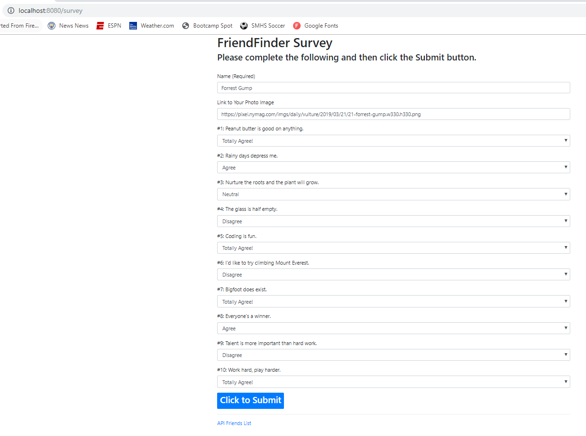
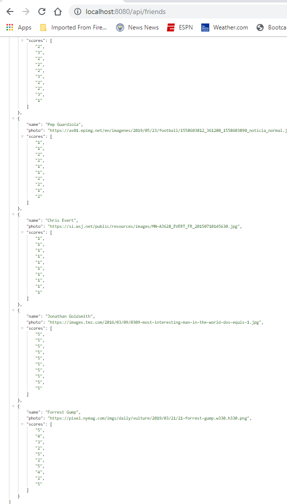

# Friend-Finder

### Overview
Friend-Finder is a compatibility-based application; basically a friend app that takes in results from the users' surveys, then compares the answers among users. The app then displays the name and picture of the user with the best overall match.

### Setup
1. Clone the repo.
2. In Terminal/Bash window, enter "npm install".
3. You will need to supply your own `.env` file.
4. In Terminal/Bash enter "node server.js".

### Screen Shots

Screen shots showing execution of liri.js:

1.  the initial home screen:

    

2.  the survey:

    

3.  resulting friend suggestion (closest match):

    

4.  listing the contents of the Friends API:

    

## Author
Philip Hu